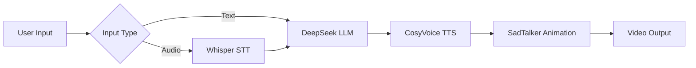

# ElderCompanion AI - Digital Companion for Seniors 👵👴💬

https://github.com/user-attachments/assets/980f6a6c-dccd-438d-b639-4621309918cc
  
A compassionate AI companion that helps elderly individuals combat loneliness by simulating conversations with loved ones using their personality, voice, and appearance.

## Key Features ✨
- **Personalized Digital Companions** - Create AI versions of family members
- **Multilingual Support** - English, Mandarin, Cantonese, Japanese, Korean & Arabic
- **Voice Cloning** - Recreate familiar voices from short samples
- **Animated Avatars** - Bring photos to life with synchronized lip movements
- **Personality Customization** - Capture unique mannerisms and speech patterns
- **Conversational AI** - Natural dialogue powered by DeepSeek LLM

## Installation Guide ⚙️

### Prerequisites
- Python 3.8+
- NVIDIA GPU (recommended) with CUDA 11.8
- FFmpeg installed system-wide

### Step-by-Step Setup
1. Clone the repository:
```bash
git clone https://github.com/yourusername/ElderCompanion.git
cd ElderCompanion

```
2. Create and activate virtual environment:

```bash

python -m venv venv
source venv/bin/activate  # Linux/Mac
```

3. Install dependencies:
```
bash

pip install -r requirements.txt
```
4. Configure API Keys (Critical Step!)
    - Create .env file in project root:
    ```bash
    touch .env
    ```
    - Add your DeepSeek API key:
    ```env
    DEEPSEEK_API_KEY=your_api_key_here
    ```
    
5. Download models:

```bash

python download_models.py --all

#or if you want to Just SadTalker models
python download_models.py --sadtalker #likewise for other models

```

## Running the Application 🚀
```bash
python webui_V6.py --port 8000
```

Access the interface at: http://localhost:8000

## Usage Guide 📖
**Setup Tab** 
- Upload a clear frontal photo of yourself (if you want this person to talk with your elder)
- Record voice or upload 10-15 seconds (.wav) of their voice
- Enter sample phrase matching the audio
- Complete personality questionnaire
- Click "Save All Settings"

**Conversation Tab**
- Text Chat: Type messages in the text box
- (or) Voice Chat: Click microphone to speak
- Adjust Settings(**Don't forget to set languages**):
    Language selection (supports 6 languages)
    Output's speech speed control
- View animated responses in the video panel
## Technical Architecture 🧠


## Troubleshooting 🔧
|                                               Issue                                               |                     Solution                    |
|:-------------------------------------------------------------------------------------------------:|:-----------------------------------------------:|
| CUDA out of memory                                                                                | Reduce batch size in webui_V6.py                |                      
| Arabic TTS not working                                                                            | Run pip install transformers sentencepiece      |                        
| Video generation fails                                                                            | Verify FFmpeg installation with ffmpeg -version |                       
| API errors                                                                                        | Confirm .env file has correct DEEPSEEK_API_KEY  |                       
| Robotic voice                                                                                     | Use longer (15+ sec) high-quality voice samples |     

## Ethical Considerations ⚖️
  - Clearly disclose AI nature to all users
  - Never impersonate without consent
  - Store personal data securely
  - Provide opt-out mechanisms
  - Regularly audit for bias in responses
