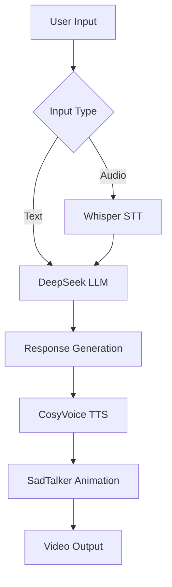

# ElderCompanion AI (HearthVoice) - Digital Companion for Seniors 👵👴💬
**Demo video** (open sound to hear voice)

https://github.com/user-attachments/assets/980f6a6c-dccd-438d-b639-4621309918cc

**Our Mission**: Combat elderly isolation by recreating the presence of loved ones through AI technology. When distance and busy lives separate families, ElderCompanion provides comforting digital companionship that feels authentically human.

### The Heartbreaking Problem ❤️‍🩹
- 1 in 4 seniors experiences damaging social isolation
- Families struggle to maintain regular contact across distances
- Elders miss daily interactions with grandchildren
- Traditional solutions (nurses, caregivers) can't replace family bonds

### Our Compassionate Solution 🤖❤️
We create **digital embodiments of family members** that provide:
- 💬 Natural conversations using cloned voices
- 👤 Animated avatars from family photos
- 🌍 Multilingual communication
- 📚 Personalized memories and mannerisms


## How It Works

## Why It Matters

|                                       Before ElderCompanion                                       |               After ElderCompanion              |             
|:-------------------------------------------------------------------------------------------------:|:-----------------------------------------------:|
| Days without conversation                                                                         | Meaningful daily interactions                   |                  
| Fading memories of loved ones                                                                     | Preserved personalities                         |            
| Isolation-induced decline                                                                         | Improved mental wellbeing                       |                       
| Family guilt                                                                                      | Peace of mind                                   |    

## Table of Contents
- [Key Features](#key-features-)
- [Installation Guide](#installation-guide-)
  - [Prerequisites](#prerequisites)
  - [Setup](#step-by-step-setup)
- [Usage](#usage-guide-)
- [Architecture](#technical-architecture-)
- [Troubleshooting](#troubleshooting-)
- [Ethics](#ethical-considerations-)

## Key Features ✨
- **Personalized Digital Companions** - Create AI versions of family members
- **Multilingual Support** - English, Mandarin, Cantonese, Japanese, Korean & Arabic
- **Voice Cloning** - Recreate familiar voices from short samples
- **Animated Avatars** - Bring photos to life with synchronized lip movements
- **Personality Customization** - Capture unique mannerisms and speech patterns
- **Conversational AI** - Natural dialogue powered by DeepSeek LLM
- **Accessibility Focus** - Large UI elements, voice-first interaction

## Installation Guide ⚙️

### Prerequisites
- Python 3.8+
- NVIDIA GPU (recommended) with CUDA 11.8 (8 GB)
- 18 B+ free storage space

### Step-by-Step Setup
1. Clone the repository:
```bash
git clone https://github.com/yourusername/ElderCompanion.git
cd ElderCompanion

```
2. Create and activate virtual environment:

```bash

python -m venv venv
source venv/bin/activate  # Linux/Mac
```

3. Install dependencies:
```
bash

pip install -r requirements.txt
```
4. Configure API Keys (Critical Step!)
    - Create .env file in project root:
    ```bash
    touch .env
    ```
    - Add your DeepSeek API key:
    ```env
    DEEPSEEK_API_KEY=your_api_key_here
    ```
    
5. Download models:

```bash

python download_models.py --all

#or if you want to Just SadTalker models
python download_models.py --sadtalker #likewise for other models

```

## Running the Application 🚀
```bash
python webui_V6.py --port 8000
```

Access the interface at: http://localhost:8000

## Usage Guide 📖
**Setup Tab** 
- Upload a clear frontal photo of yourself (if you want this person to talk with your elder)
- Record voice or upload 10-15 seconds (.wav) of their voice
- Enter sample phrase matching the audio
- Complete personality questionnaire
- Click "Save All Settings"

**Conversation Tab**
- Text Chat: Type messages in the text box
- (or) Voice Chat: Click microphone to speak
- Adjust Settings(**Don't forget to set languages**):
    Language selection (supports 6 languages)
    Output's speech speed control
- View animated responses in the video panel
## Technical Architecture 🧠


## Troubleshooting 🔧
|                                               Issue                                               |                     Solution                    |
|:-------------------------------------------------------------------------------------------------:|:-----------------------------------------------:|
| CUDA out of memory                                                                                | Reduce batch size in webui_V6.py                |                      
| Arabic TTS not working                                                                            | Run pip install transformers sentencepiece      |                        
| Video generation fails                                                                            | Verify FFmpeg installation with ffmpeg -version |                       
| API errors                                                                                        | Confirm .env file has correct DEEPSEEK_API_KEY  |                       
| Robotic voice                                                                                     | Use longer (15+ sec) high-quality voice samples |     

## Ethical Considerations ⚖️
This isn't about replacing human connection - it's about augmenting it:
- Always transparent about AI nature
- Encourages real human contact ("Your granddaughter will visit Saturday!")
- Designed to complement - not replace - family relationships
- Strict consent requirements for impersonation
